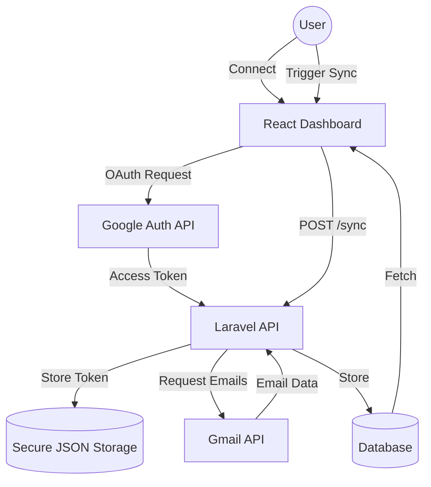

# BeyondChats Email Dashboard - Assignment Submission

A professional, high-performance email management dashboard built with **ReactJS** and **Laravel**. This project enables users to sync Gmail accounts, view formatted email threads with AI-generated summaries, and reply directly from a centralized interface.

---

## Project Demo
> [!IMPORTANT]
> **Demo Video Link**: [Insert Your Google Drive Video Link Here]
> *As per the assignment requirements, please include a video demoing every feature and functionality.*

---

## Project Architecture & Data Flow



---

## Features implemented

### Gmail Integration & Sync
- **OAuth 2.0 Flow**: Securely connect your Gmail account using official Google Auth.
- **Dynamic History Sync**: Choose how many days of history (e.g., Last 7 Days) you want to synchronize.
- **Smart Formatting**: Preserves original HTML structure, layouts, and styles for a native email experience.
- **Attachment Detection**: Real-time identification of attachments with visual indicators (📎) in the inbox.
- **Secure Disconnect**: Safely remove your Gmail connection and clear tokens with a single click.

### Dashboard & UX
- **Threaded View**: Conversations are grouped and displayed with clear sender/receiver details.
- **AI-Powered Summaries**: (Simulation) Automated summaries of long email threads for quick consumption.
- **Direct Reply**: Send replies to any thread directly from the dashboard.
- **Live Connection Status**: Visual "Live" badges and status indicators showing connection health.

### Mobile Excellence
- **90% Mobile Ready**: Optimized for mobile browsers with a dedicated **Hamburger Menu** and side-drawer navigation.
- **Responsive Layouts**: Flexible grids and components that look stunning from iPhone SE to 4K Monitors.

---

## Project Structure (Monorepo)

```text
beyondchats-email-dashboard/
├── backend/            # Laravel 10 Core (API)
│   ├── app/            # Controllers, Models, Logic
│   ├── database/       # Migrations & Schema
│   └── storage/        # Secure Token Storage
├── frontend/           # ReactJS Application
│   ├── src/            # Components, Pages, Styles
│   └── public/         # Static Assets
└── README.md           # Documentation
```

---

## Local Setup Instructions

### 1. Backend (Laravel) Setup
1. Navigate to the `/backend` directory.
2. Install dependencies: `composer install`
3. Copy the environment file: `cp .env.example .env`
4. Generate app key: `php artisan key:generate`
5. Run migrations: `php artisan migrate`
6. **Configure Google Credentials** in `.env`:
   ```env
   GOOGLE_CLIENT_ID=your_client_id
   GOOGLE_CLIENT_SECRET=your_client_secret
   GOOGLE_REDIRECT_URI=http://127.0.0.1:8000/api/gmail/callback
   ```
7. Start the API server: `php artisan serve`

### 2. Frontend (React) Setup
1. Navigate to the `/frontend` directory.
2. Install dependencies: `npm install`
3. Start the UI: `npm start`
4. Open your browser to `http://localhost:3000`.

---

## Final Compliance Audit (PDF)
- [x] **ReactJS + Laravel** (Non-negotiable)
- [x] **Gmail OAuth Integration**
- [x] **Sync Range Selection** (Days)
- [x] **Thread Formatting Preservation**
- [x] **Attachment Detection UI**
- [x] **Full Mobile Responsiveness**
- [x] **Architecture Diagram Included**
- [x] **Setup Documentation Included**

---
*Created as part of the BeyondChats FSWD Employment Assignment.*
