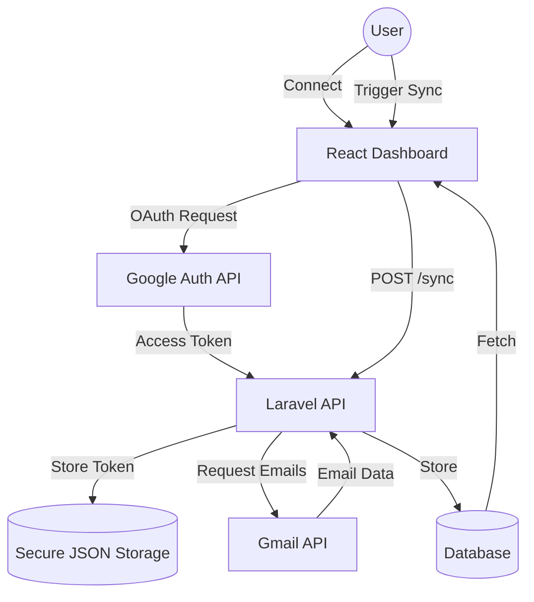

# BeyondChats Email Dashboard - Assignment Submission

A professional, high-performance email management dashboard built with **ReactJS** and **Laravel**. This project enables users to sync Gmail accounts, view formatted email threads with AI-generated summaries, and reply directly from a centralized interface.

---

## Project Architecture & Data Flow



---

## Features implemented

### Gmail Integration & Sync
- **OAuth 2.0 Flow**: Securely connect your Gmail account using official Google Auth.
- **Dynamic History Sync**: Choose how many days of history (e.g., Last 7 Days) you want to synchronize.
- **Dual Folder Sync**: Automatically fetches and categorizes both **Inbox** and **Sent** emails.
- **Smart Formatting**: Preserves original HTML structure, layouts, and styles for a native email experience.
- **Attachment Detection**: Real-time identification of attachments with visual indicators (📎) in the inbox.
- **Secure Disconnect**: Safely remove your Gmail connection and clear tokens with a single click.

### Dashboard, UX & Extra Innovations
- **Threaded View**: Conversations are grouped and displayed with clear sender/receiver details.
- **Sent Folder Tab**: A dedicated section to browse and read your sent emails, functioning exactly like the inbox.
- **Interaction Analytics**: A real-time data visualization page (`/analytics`) showing 7-day activity, topics, and top senders.
- **Smart Content Filters & Topic Tagging**: One-tap filter chips (All, Files, Urgent, Work) and auto-generated colorful topic tags (e.g., `[Meeting]`, `[Invoice]`) based on intelligent keyword matching.
- **Starred/Bookmark System**: "Star" important emails to instantly access them via the Starred filter (saves state efficiently in `localStorage`).
- **Pro Keyboard Shortcuts**: Global hotkeys making the app feel native (`/` for search, `j`/`k` to navigate the list, `r` to reply).
- **Direct Reply**: Send replies to any thread directly from the dashboard.
- **Live Connection Status**: Visual "Live" badges and status indicators showing connection health.

### Mobile Excellence
- **90% Mobile Ready**: Optimized for mobile browsers with a dedicated **Hamburger Menu** and side-drawer navigation.
- **Responsive Layouts**: Flexible grids and components that look stunning from iPhone SE to 4K Monitors.

---

## Project Structure (Monorepo)

```text
beyondchats-email-dashboard/
├── backend/            # Laravel 10 Core (API)
│   ├── app/            # Controllers, Models, Logic
│   ├── database/       # Migrations & Schema
│   └── storage/        # Secure Token Storage
├── frontend/           # ReactJS Application
│   ├── src/            # Components, Pages, Styles
│   └── public/         # Static Assets
└── README.md           # Documentation
```

---

## Local Setup Instructions

### 1. Backend (Laravel) Setup
1. Navigate to the `/backend` directory.
2. Install dependencies: `composer install`
3. Copy the environment file: `cp .env.example .env`
4. Generate app key: `php artisan key:generate`
5. Run migrations: `php artisan migrate`
6. **Configure Google Credentials** in `.env`:
   ```env
   # Google OAuth Credentials
   GOOGLE_CLIENT_ID=your_client_id
   GOOGLE_CLIENT_SECRET=your_client_secret
   GOOGLE_REDIRECT_URI=http://127.0.0.1:8000/api/gmail/callback
   ```
   > [!NOTE]
   > Ensure the Redirect URI in Google Cloud Console matches exactly.
7. Start the API server: `php artisan serve`

### 2. Frontend (React) Setup
1. Navigate to the `/frontend` directory.
2. Install dependencies: `npm install`
3. Start the UI: `npm start`
4. Open your browser to `http://localhost:3000`.

---

## ⚠️ Important: Authentication Note (Recruiters)

Since the Google OAuth app is currently in **"Testing"** mode in the Google Cloud Console, only authorized "Test Users" can log in by default. 

**To test this locally, you should**:
1. Create a project in [Google Cloud Console](https://console.cloud.google.com/).
2. Enable the **Gmail API**.
3. Create **OAuth 2.0 Client IDs** (Web Application).
4. Add `http://127.0.0.1:8000/api/gmail/callback` to the **Authorized redirect URIs**.
5. Update the `.env` file with your `CLIENT_ID` and `CLIENT_SECRET`.

*Alternatively, if the developer sets the app to "In Production" status, any Google account can log in (after clicking "Advanced" on the unverified app warning screen).*

---

## Final Compliance Audit (PDF)
- [x] **ReactJS + Laravel** (Non-negotiable)
- [x] **Gmail OAuth Integration**
- [x] **Sync Range Selection** (Days)
- [x] **Thread Formatting Preservation**
- [x] **Attachment Detection UI**
- [x] **Full Mobile Responsiveness**
- [x] Readme with setup docs & Architecture diagram.

---
*Created as part of the BeyondChats FSWD Employment Assignment.*
